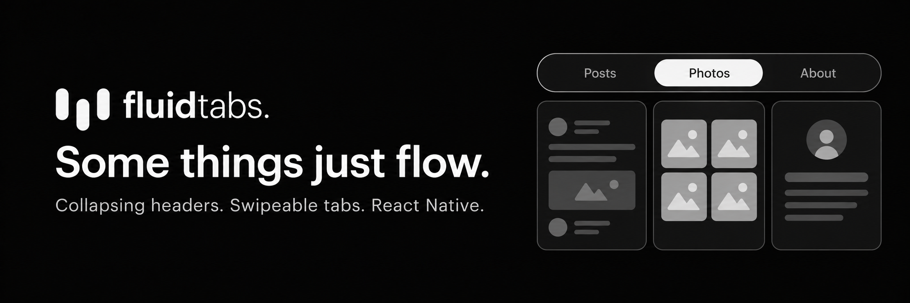

<p align="center">
  
</p>

# Fluid Tabs

Collapsing headers, swipeable tabs, and synchronized scrolling for React Native.

**[Website](https://fluid-tabs.vercel.app/) · [Live examples](https://fluid-tabs.vercel.app/examples) · [npm](https://www.npmjs.com/package/react-native-collapsible-fluid-tabs)**

## Installation

```sh
npm install react-native-collapsible-fluid-tabs
```

See the [installation guide](https://fluid-tabs.vercel.app/docs/installation) for required dependencies and setup.

[MIT](./LICENSE)
